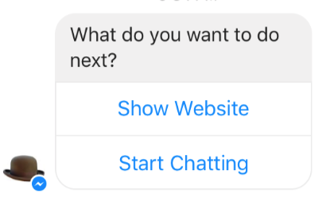
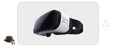
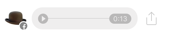
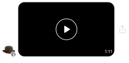
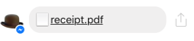
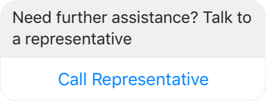
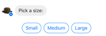

# Broadcasting Api

Broadcasting Api allow you to sent messages to chatbot users via an http request.

## Authentication

A token generated on "Settings" tab in dashboard.kodabots.com should be passed on each API request in "Authorization" header.

## Send Broadcast

`https://broadcast.kodabots.com/api/send`

All queries to the Broadcasting API must be served via POST, with the content type application/json. Body should contain valid json object with implements [IBroadcastApi](../broadcast-api.ts) interface.

| Param  | Type | Description
| -------- | --- |------------- |
| to | string[]  | {{platform_user_id}} user variable with you should get from "Api Request Block". Max 1000.
| desc (optional) | string | Description with is shown on broadcast stats page.
| message_tag | string | A message tag gives you the ability to send messages to a person outside of the 24h window. https://developers.facebook.com/docs/messenger-platform/send-messages/message-tags.
| block_id (optional) | string | A [block id](#block-id) with should be send. 
| elements (optional) | [Element](#elements-reference)[] | An array of elements to send.

At least elements or block_id properties must be set.

Example request:

```bash
curl -X POST \
  https://broadcast.kodabots.com/api/send \
  -H 'Content-Type: application/json' \
  -H 'Authorization: TOKEN' \
  -d '{
    "to" : ["USER_ID_1", "USER_ID_2"],
    "elements" : [{
        "type" : "photo",
        "url" : "https://raw.githubusercontent.com/kodabots/Docs/master/docs/images/cover.png"
    },{
        "type" : "message",
        "text" : "Message 123",
    }],
    "message_tag" : "TICKET_UPDATE"
}'
```

## Elements Reference

### Message



Message allow you to send a structured message that includes text and optional buttons.

| Param  | Type | Description
| -------- | --- |------------- |
| type | string  | Value must be 'message'.
| text | string  | UTF-8-encoded text of up to 640 characters. Text will appear above the buttons.
| buttons (optional) | [Button](#button-reference)[] | Max 3.
| quick_replies (optional) | [Reply](#quick-reply-reference)[] | An array of objects the describe the quick reply buttons to send. A maximum of 11 quick replies are supported.

Example

```json
{
    "type" : "message",
    "text" : "Message 123",
    "buttons": [ {
        "type": "url",
        "title": "Link",
        "url": "https://kodabots.com"
    }, {
        "type": "phone_number",
        "title": "Call",
        "prefix": "+48",
        "number": "600123123"
    }]
}
```

### Photo



| Param  | Type | Description
| -------- | --- |------------- |
| type | string  | Value must be 'photo'.
| url | string  | Messenger supports JPG, PNG and GIF images. If you are having issues with GIF rendering, please try to reduce the file size.
| quick_replies (optional) | [Reply](#quick-reply-reference)[] | An array of objects the describe the quick reply buttons to send. A maximum of 11 quick replies are supported.

#### Example

```json
{
    "type" : "photo",
    "url" : "https://url.pl",
}
```

### Gallery


The gallery allows you to send a structured message that includes an image, text and buttons. A gallery with multiple templates described in the elements array will send a horizontally scrollable carousel of items, each composed of an image, text and button.

| Param  | Type | Description
| -------- | --- |------------- |
| type | string  | Value must be 'gallery'.
| elements | [Element](#element)[]  | Specifying multiple elements will send a horizontally scrollable carousel of templates. A maximum of 10 elements is supported.
| quick_replies (optional) | [Reply](#quick-reply-reference)[] | An array of objects the describe the quick reply buttons to send. A maximum of 11 quick replies are supported.


#### Element

At least one property must be set in addition to title.

| Param  | Type | Description
| -------- | --- |------------- |
| title | string  | The title to display in the element. 80 character limit.
| subtitle (optional) | string  |  The subtitle to display in the element. 80 character limit. 
| image_url (optional) | string  | The URL of the image to display in the element. Recommended resolution: 955x500px
| default_action_url (optional) | string  | The URL executed when the element is tapped. 
| buttons (optional) | [Button](#button-reference)[] | Max 3 buttons

Example

```json
{
    "type" : "gallery",
    "elements" : [{
        "title" : "Title 1",
        "subtitle" : "Subtitle 1",
        "image_url" : "https://raw.githubusercontent.com/kodabots/Docs/master/docs/images/cover.png",
        "default_action_url" : "https://kodabots.com",
        "buttons": [{
            "type": "go_to",
            "title": "Go To",
            "go_to_block": "BLOCK_ID_2"
        }, {
            "type": "url",
            "title": "Link",
            "url": "https://kodabots.com"
        }, {
            "type": "phone_number",
            "title": "Call",
            "prefix": "+48",
            "number": "600123123"
        }]
    }]
}
```

### Audio



#### Properties 

| Param  | Type | Description
| -------- | --- |------------- |
| type | string  | Value must be 'audio'.
| url | string  | Messenger supports MP3, OGG, WAV audios, which are up to 25MB in size.
| quick_replies (optional) | [Reply](#quick-reply-reference)[] | An array of objects the describe the quick reply buttons to send. A maximum of 11 quick replies are supported.

#### Example

```json
{
    "type" : "photo",
    "url" : "https://url.pl",
}
```

### Video



#### Properties 

| Param  | Type | Description
| -------- | --- |------------- |
| type | string  | Value must be 'video'.
| url | string  | Messenger supports MP4 videos, which are up to 25MB in size.
| quick_replies (optional) | [Reply](#quick-reply-reference)[] | An array of objects the describe the quick reply buttons to send. A maximum of 11 quick replies are supported.

#### Example

```json
{
    "type" : "video",
    "url" : "https://url.pl",
}
```

### File



#### Properties 

| Param  | Type | Description
| -------- | --- |------------- |
| type | string  | Value must be 'file'.
| url | string  | Max 25MB.
| quick_replies (optional) | [Reply](#quick-reply-reference)[] | An array of objects the describe the quick reply buttons to send. A maximum of 11 quick replies are supported.

Example

```json
{
    "type" : "file",
    "url" : "https://url.pl",
}
```

## Button Reference

Button can be used in [gallery](#gallery) and [message](#message) element.

### Url Button


The URL Button opens a web page in the Messenger webview. This allows you to enrich the conversation with a web-based experience, where you have the full development flexibility of the web. For example, you might display a product summary in-conversation, then use the URL button to open the full product page on your website.

#### Properties 

| Param  | Type | Description
| -------- | --- |------------- |
| type | string  | Value must be 'url'.
| title | string  | Max 20 characters. Copy with will be shown on the button.
| url | string | Url of the webview.

#### Example

```json
{
    "type" : "url",
    "url" : "https://url.pl",
    "title" : "Click me!"
}
```

### Go to Button

Block will be send to user after taping the button.

#### Properties 

| Param  | Type | Description
| -------- | --- |------------- |
| type | string  | Value must be 'go_to'.
| title | string  | Max 20 characters. Copy with will be shown on the button.
| go_to_block | string | [block id](#block-id)

#### Example 

```json
{
    "type" : "go_to",
    "title" : "Go to block",
    "go_to_block" : "BLOCK_ID"
}
```

### Phone Number Button

<!--  -->

#### Properties 

| Param  | Type | Description
| -------- | --- |------------- |
| type | string  | Value must be 'phone_number'.
| title | string  | Max 20 characters. Copy with will be shown on the button.
| prefix | string | Country code with '+' e.g. +48
| number | number | Phone number without any special characters e.g. 123123123.

#### Example 

```json
{
    "type" : "phone_number",
    "title" : "Call",
    "prefix" : "+48",
    "number" : 123123123
}
```

## Quick Reply Reference

Quick replies provide a way to present a set of up to 11 buttons in-conversation that contain a title and appear prominently above the composer.



#### Properties 

| Param  | Type | Description
| -------- | --- |------------- |
| title | string  | Max 20 characters. Copy with will be shown on the quick reply.
| go_to_block | string | [block id](#block-id)

## Success Response

When broadcast is successful sent, API return ID. This ID can be passed to Analytics API to get stats informations such as open rates or buttons CTRs.

Result 200
```json
{
    "broadcast_id" : "ID",
}
```

## Errors

Errors are returned using standard HTTP error code syntax. In general, codes in the 2xx range indicate success, codes in the 4xx range indicate an error (wrong or missing parameters, insufficient authentication etc.), and codes in the 5xx range indicate an error with KODA Bots servers. Any additional info is included in the status of the return call, JSON-formatted.

HTTP status codes summary
- 400 – The request was incorrect. Please make sure that the passed arguments are matching format provided in the method documentation.
- 401 – Unauthorized. In most cases you pass invalid token.
- 500 – Internal Server Error. Something unexpected happened on our end. Please try again or contact support.

### Examples

Result 400
```json
{
    "code": "BAD_USER_ID",
    "message": "Bad user \"USER_ID_1\""
}
```

Result 401
```json
{
    "code": "UNAUTHORIZED",
    "message": "Invalid Api token"
}
```

<!-- ## User variables

In all texts you can use user variables e.g. first_name. Full list of available properties you can find [here](user-variables.md). -->

<!-- ### Example

```bash
curl -X POST \
  https://broadcast.kodabots.com/api/send \
  -H 'Content-Type: application/json' \
  -H 'Authorization: TOKEN' \
  -d '{
    "to" : ["USER_ID_1", "USER_ID_2"],
    "elements" : [{
        "type" : "message",
        "text" : "Hi {{first_name}}. How are you?",
    }],
    "message_tag" : "NON_PROMOTIONAL_SUBSCRIPTION"
}'
``` -->

## Block Id

Easiest way to get block id is copy it from dashboard`s url.

https:// dashboard.kodabots.com/bot/e394bb27-5f84-a8b7-659a-8779c7605321/create-bot/**f60ea240-4cda-d1f9-032f-05eba5794059**

## Postman Collection

Postman is a popular tool to help test APIs. To make it more convenient for developers who are integrating with our platform, we've developed a Postman collection that contains the full set of APIs.

Download and install Postman. After that click [here](https://raw.githubusercontent.com/kodabots/Docs/master/KODA%20Bots%20Public%20Api.postman_collection.json) to download collection.

## Contact

Feel free to say hello and sent message on developers@kodabots.com.
